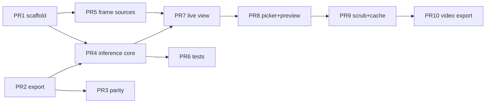

# iOS Frontend — Implementation Plan

Execution plan for `frontend/IOS_README.md`, derived from `IOS_IMPLEMENTATION_RESEARCH.md` and
verified against the checked-in Python pipeline.

---

## 0. Verified ground truth

Everything below was read out of the repo, not assumed.

### 0.1 Checkpoint `exports/colab_e2e_best_2.pt`

```
keys              bbox_model_state, keypoint_model_state, pose_model_state,
                  label_names, keypoint_image_{height,width}, bbox_image_{height,width},
                  epoch, best_val_acc, best_val_loss, args
label_names       ['Backhand', 'Forehand', 'Ready_Position', 'Serve']
bbox image size   256 x 256
kp image size     128 x 128       <- authoritative; inference.py's (256,256) default is stale
pose fc1.weight   (384, 130)      -> hidden_dim = 384   (args has NO 'hidden_dim' key)
pose out.weight   (4, 192)        -> num_classes = 4
best_val_acc      0.9431  @ epoch 24
```

`args` also lacks `dropout` and `visibility_threshold`; `backend/api/services/model_service.py:142`
defaults them to `0.4` / `0.0`. Dropout is inert in `eval()`, and `visibility_threshold = 0.0`
makes `_apply_visibility_mask` a pass-through — so neither affects exported numerics.

### 0.2 The pipeline, as actually implemented

| Stage | Source | Behavior |
|---|---|---|
| 1 in | `model_service.py:262` | `image.resize((256,256), BILINEAR)` — **squash**, aspect NOT preserved. `ToTensor()` → `1/255`, no mean/std. |
| 1 out | `models/bbox_detection.py:47` | sigmoid-constrained `(x, y, w, h)`, all in [0,1]. |
| 1→2 | `preprocessing/pil_preprocessing.py:6` | `norm_bbox_to_xyxy_pixels`: scale by W/H **only if** `max(|x|,|y|,|w|,|h|) ≤ 1.5`; `round`; clamp `x1∈[0,W-1]`, `y1∈[0,H-1]`, `x2∈[x1+1,W]`, `y2∈[y1+1,H]`. |
| 2 in | `pil_preprocessing.py:50` | crop **original** frame → `letterbox_resize` to 128×128, black pad, centered. |
| 2 out | `models/keypoint_detection.py` | U-Net, 18 raw-logit heatmaps at 128×128 (input size preserved). |
| 2 decode | `preprocessing/tensor_preprocessing.py:8` | per-channel `flat.max()` → `y = idx // W`, `x = idx % W`, `vis = raw max logit` (**no sigmoid**). Then `x /= 127`, `y /= 127`. |
| 3 | `models/pose_classification.py:130` | 130-d engineered features → 384 → 384 → 192 → 4, **`forward()` already softmaxes**. |
| draw | `backend/api/utils/image_outputs.py:83` | `_letterbox_xy_to_bbox_xy` uses **unclamped** `scale = min(128/w, 128/h)`. |

### 0.3 The three known divergences (decided, not open)

1. **Letterbox upscale.** Python `letterbox_resize` uses `PIL.thumbnail`, which *never upscales*.
   The reverse map in `image_outputs.py:95` and the training targets in
   `tensor_preprocessing.py:120` both use the **unclamped** `scale`. Python is internally
   inconsistent for crops smaller than 128px. → **Swift implements unclamped scale** (always fit
   to 128). Matches training and the reverse map; only diverges from `inference.py` on sub-128
   crops, which are degenerate anyway.
2. **Double softmax.** `pose_classification.forward()` softmaxes, then `model_service.py:274`
   softmaxes again — flattening the web app's confidences. → **Swift softmaxes once**, matching
   `inference/inference.py`. Argmax is identical either way; confidence values will legitimately
   read *higher* than the web demo.
3. **Label case.** Checkpoint ships `Ready_Position`; the backend normalizes to
   `ready_position`. → Swift reads the normalized form from the export script's emitted JSON,
   never hardcoded blind.

---

## 1. Environment audit

Run on this Mac before planning the work split.

| Capability | Status | Consequence |
|---|---|---|
| `gh` auth, repo `hanyiliu/tennis-pose-detection` | ✅ ADMIN, public, `main` **unprotected** | Autonomous push + auto-merge is possible. |
| Python 3.13 (`/usr/local/bin/python3.13`, brew) | ✅ | Host venv for `coremltools` 9.x + torch 2.x. |
| System python3.9 + torch 2.2.2 | ⚠️ numpy ABI broken, no coremltools | Do **not** use; create an isolated venv. |
| Swift 6.3 compiler (`swiftc`) | ✅ macOS target only | Enables the host-side verification harness (§4). |
| **Xcode.app** | ❌ **NOT INSTALLED** — only `/Library/Developer/CommandLineTools` | **Blocker.** No iOS SDK, no `simctl`, no simulators, no `xcodebuild -destination 'iOS Simulator'`. |
| `xcodegen` | ❌ not installed | `brew install xcodegen` (no sudo needed). |

### 1.1 The Xcode blocker — scope impact

Installing Xcode needs the Mac App Store (~17 GB) plus `sudo xcode-select -s` and a license
accept — all of which require the user's password. **I cannot do it.**

What this does **not** block: the Core ML export and its Python parity proof, every line of Swift
source, the XcodeGen spec, the unit-test source, and the numeric verification harness in §4.

What it **does** block, until Xcode lands: `xcodegen generate` → `xcodebuild` for iOS,
`xcodebuild test`, launching in the Simulator pane, tap-through QA, screenshots. Those become a
final verification milestone (M9), gated on the install — not a reason to hold the other work.

```bash
sudo xcode-select -s /Applications/Xcode.app/Contents/Developer && sudo xcodebuild -license accept
```

---

## 2. Deliverables and PR split

Hard constraint: **≤ 500 added lines per PR**, unlimited deletions. Verify before every PR:

```bash
git diff --numstat main...HEAD | awk '{a+=$1} END {print a+0}'
```

Model artifacts (`.mlpackage`, ~35 MB) are **git-ignored**, not LFS-committed. `make export`
regenerates them from the checkpoint already in `exports/`. This keeps every PR text-only and
avoids adding LFS to a repo that has never used it.

| PR | Title | Contents | Budget |
|---|---|---|---|
| 1 | Plan + Xcode project scaffold | this file, `frontend/ios/project.yml`, `Info.plist`, `TPDApp.swift`, `Makefile`, `.gitignore`, `frontend/ios/README.md` | ~330 |
| 2 | Core ML export tooling | `tools/export_coreml.py`, `tools/requirements.txt`, emits `TPDLabels.json` + `TPDModelSpec.json` | ~300 |
| 3 | Python↔Core ML parity harness | `tools/parity_check.py`, `tools/make_fixtures.py`, fixture JSON schema | ~350 |
| 4 | Inference core | `Inference/LetterboxMath.swift`, `TPDResult.swift`, `TPDInferenceEngine.swift`, `CIImage+TPD.swift` | ~450 |
| 5 | Frame sources | `Inference/FrameSource.swift`, `CameraFrameSource.swift`, `VideoFileFrameSource.swift` | ~350 |
| 6 | Swift unit tests + host harness | `TPDTests/LetterboxMathTests.swift`, `CoordinateMappingTests.swift`, `tools/swift_parity_host/` | ~400 |
| 7 | Overlays + Live Camera View | `Views/OverlayCanvas.swift`, `ToggleBar.swift`, `FramePreview.swift`, `LiveCameraView.swift`, `LiveViewModel.swift` | ~470 |
| 8 | Photo picker + preview | `Views/PhotoPickerSheet.swift`, `PhotoPreviewView.swift`, `MediaLoader.swift`, `PreviewViewModel.swift` | ~470 |
| 9 | Video scrub + result cache | `Views/ScrubBar.swift`, `VideoFrameTicker.swift`, `ResultCache.swift` | ~350 |
| 10 | Overlaid video export | `Export/VideoExporter.swift`, `OverlayRenderer.swift`, `ExportProgressView.swift`, Photos save | ~450 |

Ten PRs, ~3,900 added lines total.

### 2.1 Dependency graph



### 2.2 Execution waves

| Wave | Parallel PRs | Rationale |
|---|---|---|
| 1 | **1, 2** | Scaffold and export tooling touch disjoint trees. |
| 2 | **3, 4, 5** | Parity (Python) ⟂ inference core ⟂ frame sources. All three only need wave 1. |
| 3 | **6, 7** | Tests target PR4; live view needs PR4+PR5. Disjoint files. |
| 4 | **8** | Reuses `OverlayCanvas`/`ToggleBar` from PR7 — must serialize. |
| 5 | **9** | Extends PR8's preview view. |
| 6 | **10** | Needs PR9's cache to avoid re-inferring every exported frame. |

Files are partitioned so no two concurrent agents write the same path. `project.yml` uses
`sources: [TPD]` (directory glob), so adding Swift files never edits the spec — the one file that
would otherwise be a guaranteed conflict.

---

## 3. Design decisions

**Two `.mlpackage`s, crop in Swift.** `TPDBBox` (image 256×256 → `bbox` (4,)) and `TPDPoseNet`
(image 128×128 → `probs` (1,4) + `keypoints` (1,18,3), stages 2+3 fused with argmax/normalize
baked into the graph). The crop between stages depends on stage-1 output, so it cannot live inside
a single traced graph without dynamic shapes. Fallback if the fused trace fails to convert: export
stage 2 raw (heatmaps out) + stage 3 separately, decode in Swift — the decode is 12 lines either
way, so this is a cheap escape hatch, not a redesign.

**Single softmax, single source of labels.** `export_coreml.py` writes `TPDLabels.json`
(`["backhand","forehand","ready_position","serve"]`) and `TPDModelSpec.json` (input sizes,
keypoint count, hidden dim) next to the packages. Swift loads both from the bundle. No hardcoded
class order anywhere.

**`FrameSource` protocol is mandatory, not optional.** The Simulator has no camera
(`AVCaptureDevice.default` returns nil). `CameraFrameSource` on device, `VideoFileFrameSource`
(bundled clip, looped) under `#if targetEnvironment(simulator)`. Both yield `CVPixelBuffer` through
the same `AsyncStream`, so display and inference are byte-identical across simulator and device.

**The app renders its own frames.** `FramePreview` draws the same `CIImage` the engine consumes,
rather than using `AVCaptureVideoPreviewLayer`. This collapses overlay coordinate mapping to one
aspect-fit affine transform and removes an entire class of preview-vs-inference misalignment bugs.

**Latest-frame-wins.** An `isInferring` flag drops frames while the engine is busy. Stage 1 may run
every N frames (bbox moves slowly) with stages 2+3 every frame if device fps demands it — designed
in, off by default.

---

## 4. Verification strategy without Xcode

Three gates, all runnable on this Mac today:

1. **Python↔Core ML parity** (PR3). Same fixture image through the torch pipeline and through
   `ct.models.MLModel.predict()`. Assertions: `max|Δbbox| < 1e-2`, keypoint pixel argmax identical
   for ≥17/18 channels, `argmax(probs)` identical, `max|Δprob| < 2e-2` (fp16 tolerances).
2. **Swift syntax gate.** `swiftc -parse` over every `.swift` file. Catches syntax errors without
   an iOS SDK. Wired into the Makefile as `make lint`.
3. **Swift numeric harness** (PR6). `LetterboxMath.swift` imports only Foundation/CoreGraphics, so
   it compiles for macOS. `tools/swift_parity_host/` builds it into a CLI that reads
   JSON fixtures emitted by the Python side and asserts the forward and reverse letterbox maps
   agree with `_letterbox_xy_to_bbox_xy` to < 1e-4 px. **This proves the parity-critical math is
   right before a single simulator frame is drawn.**

Gate 4 — full iOS build, `xcodebuild test`, and simulator tap-through — becomes **M9**, unblocked
by the Xcode install. Until then every PR ships with gates 1–3 green and a stated caveat that the
iOS-only surface (SwiftUI views, AVFoundation capture, PhotosUI) is unbuilt.

Honest statement of residual risk: gates 1–3 cover the model, the math, and syntax. They do **not**
cover SwiftUI API misuse, AVFoundation wiring, or the Core ML generated-class interface. Those are
found in M9 and will need a fixup pass.

---

## 5. Milestones

| # | Milestone | Gate |
|---|---|---|
| M1 | Scaffold + export tooling merged | `make export` produces both `.mlpackage`s |
| M2 | Parity proven | `make parity` green at fp16 tolerances |
| M3 | Inference core + frame sources | `make lint` green; engine reviewed against §0.2 |
| M4 | Letterbox math proven | `make swift-parity` green (< 1e-4 px) |
| M5 | Live view + overlays | code review vs backend overlay behavior |
| M6 | Picker + photo preview | — |
| M7 | Video preview + scrub + cache | — |
| M8 | Overlaid video export + Photos save | — |
| **M9** | **iOS build + simulator QA** | **blocked on Xcode install** |
| M10 | Device pass (human): real camera, fps, `computeUnits` | user-run |

---

## 6. Risks

| Risk | Likelihood | Mitigation |
|---|---|---|
| Xcode never installed → M9 stalls | — | Everything else ships; M9 is one isolated milestone, not a dependency of PRs 1–10. |
| Fused stage-2+3 trace fails in coremltools | low | coremltools 9 supports `reduce_argmax`/`reduce_max`; documented 3-model fallback (§3). |
| fp16 flips argmax on near-tie heatmap peaks | low | Parity harness compares per-channel argmax; escalate to `ct.precision.FLOAT32` (2× size) if >1 channel drifts. |
| Swift views don't compile once Xcode lands | **medium** | Accepted and stated. Views are written conservatively against iOS 17 APIs; M9 budgets a fixup pass. |
| torch 2.x ↔ coremltools 9 version skew in the venv | medium | Pin exact versions in `tools/requirements.txt`; venv is isolated from system python3.9. |
| Orientation bugs (EXIF, rotated buffers) | medium | Force portrait via `videoRotationAngle`; `.oriented(forExifOrientation:)` on picked media; rotated fixtures in the test set. |
| PR exceeds 500 added lines | medium | `numstat` check is a hard pre-flight gate in every agent's brief; oversize branches get split. |
